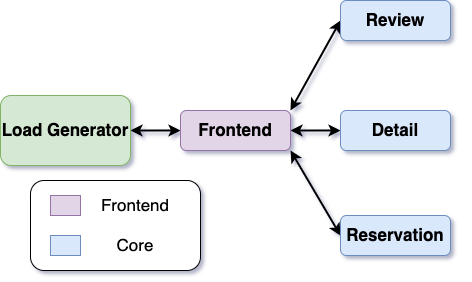
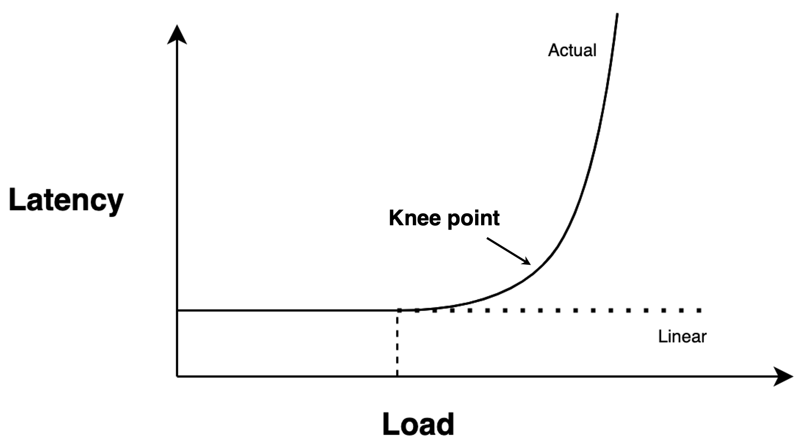
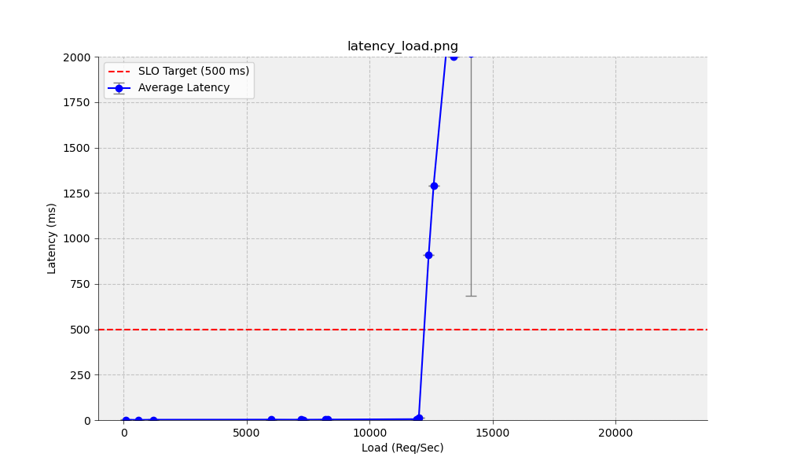

# Lab 2: Simple Performance Analysis

In this lab, we will evaluate the performance of Welp from the perspective of a user and developer. The goal of this lab is to build our intuition about analyzing application performance and to see how ideas from queueing theory can give us insights about our application.

## Lab 2 Overview
Three parties are involved, with different performance goals, in every
cloud application: developers, users, and cloud operators. This lab
will serve as an introduction to analyzing application performance
through the lens of users (Assignment 1) and developers (Assignments
2 and 3).

Users care most about quality of service. Since most cloud applications
are interactive, one very important quality metric is the service
latency of the cloud application that the user connects to. Studies
have shown that users will tolerate about 500ms of service
latency. For our application, service latency refers to the full time
period from when the user submits a request to when the user receives
the response back.  Anything above this makes users increasingly
likely to assume that there is something wrong with the provided
service and go elsewhere. Hence, this number is typically used as an
upper bound on user quality-of-service tolerance.

Cloud application developers, on the other hand, desire a simple
development experience for their applications that allows them to
elastically increase application service when there is demand. As
discussed in Lab 1, our choice of a microservices development model
provides a great degree of simplicity for developers that want to
quickly scale up applications.

Latency and throughput often interact with each other in complex
ways. For example, when throughput is higher, the service is often
busier. In this case, more requests may have to wait for service. The
additional wait time is a part of the user's experienced latency and
will cause it to go up as well. The field that explores this complex
relationship is called queueing theory. You will have learned about it
by now in the lectures.

In this assignment we will analyze the performance of our
microservices application and look at the relationship between service
latency and throughput. As part of our analysis, we will utilize
insights from queueing theory.

## Load Generators
To run our performance analysis, we need a load generator. The purpose of a load generator is to generate user requests under different conditions in order to simulate the behavior of our system in the real world.

<div style="text-align: center;">
  
</div>


### Open-loop model
In an open-loop load generator model, new request arrivals occur independently of completions. Requests are generated and sent based on a pre-defined trace/schedule or a random process such as a Poisson point process.

**Pros:** Useful for simulating specific user behavior or test scenarios. For example, we can set a given rate and see how burstier arrival distributions affect latency. Response time (latency) is also a reflection of service time and potential queueing delay, which gives us insight into the system when it is overloaded.

**Cons:** Potentially less accurate in replicating real-world usage patterns.

<div style="text-align: center;">
  
</div>


**`wrk2`:**
We will use an open-loop version of the load generator `wrk2` for HTTP benchmarking on Welp.


## Queueing Theory
Recall Little's Law from lecture, which gives the relationship between the mean throughput $`X`$, response time $`R`$ (a.k.a. service latency plus queueing delay), and number of tasks $`N`$ in a stable system: $`N = X\cdot R`$.
Importantly, this relationship applies regardless of the distribution of any of the random variables (provided the system is stable i.e. $`0 \leq U < 1`$ where $`U`$ is the utilization).

Ultimately, our goal is to understand how our system behaves under various load conditions.

<div align="center">

| Independent Variables | $`\lambda`$ |
|-----------------------|---------|
| Responding Variables  | $`X`$, $`R`$ |
</div>


With an open-loop model, we directly influence the arrival rate $`\lambda`$ and measure $`X`$ and $`R`$. Since jobs in an open-loop generator arrive independently from previous job completions, it is now possible for the arrival rate to exceed the service rate $\mu$, meaning the system can become unstable ($`U > 1 \longleftrightarrow \lambda > \mu`$). At this point, the queue can grow without bound, which pushes the response times towards infinity. By fixing the load $`\lambda`$ we can guarantee the mean number of requests in the system, but not the exact number of requests. Unfortunately, this means that even in cases where $`\lambda < \mu`$, a bursty set of arrivals in a small time period could overload our system and cause queueing delays!

## Assessing Service Performance

We typically assess performance by evaluating service latency provided
under a variety of load conditions. System load has a major effect on
the provided service. If a service is overloaded (i.e., the load exceeds the service rate), it is going to provide terrible
service---a large portion of users' requests are going to take a while,
as other requests will be processed first. Lower load conditions are going
to provide a spread of better service latencies. To see how a system
performs under a variety of load conditions, we draw latency-throughput
curves. For each throughput level (presented on the x-axis), we assess
service latency (presented on the y-axis).

For cloud operators, it is typically not enough to keep average
service latencies below 500ms. Averages *ignore* the distribution of
service experiences. Thus, they could preclude a potentially large
fraction of users from acceptable service. Instead, we care about the
largest fraction of users, knowing that some users are bound to have
bad performance for reasons outside of our control (e.g., due to a bad
Internet connection). Hence, we assess a sufficiently large percentile
of users. This is typically 99% of users or more. The actual number
depends on our assessment of what is in our control and what is
not. For this reason, we will look at 99%-ile latencies in our analysis of users.

<div style="text-align: center;">
  
</div>
Note: max point refers to the maximum throughput that you can achieve under a specific tail latency threshold (i.e. 500ms)

## Lab 2 Prep Work:

1. **Isolate CPUs**: We need a stable evaluation environment. To get it, you should add "isolcpus=0-2" to the line containing `GRUB_CMDLINE_LINUX=""` in `/etc/default/grub`. For example:

    ```
    GRUB_CMDLINE_LINUX="systemd.unified_cgroup_hierarchy=0 isolcpus=0-2"
    ```

    After this, you need to run `sudo update-grub` and then reboot your VM
    (for example, via `sudo reboot`). This will ensure that, by default, nothing runs
    on the first three CPUs of your VM, effectively isolating them. You
    can verify this by running `htop` after reboot. `htop` has a display
    of bars indicating how busy each CPU is at the top of the screen. You
    can check that cores 0..2 indeed have nothing running. Sometimes,
    there may be a little spike, which you can ignore.

    To run an application on the isolated cores you can use `taskset`. For example, `taskset -c 0-2 <app_name>` will run the application on cores 0-2. We will use this to isolate our load generator from our applications.


2. **`wrk2`**: We will use an HTTP benchmarking tool called `wrk2` for generating load on our application and measuring performance. One group member should do the following `wrk2` setup.
    ```console
    $ cd wrk2
    $ sudo apt install luarocks
    $ sudo apt-get install libssl-dev
    $ sudo apt-get install libz-dev
    $ sudo luarocks install luasocket
    $ sudo apt install make
    $ make
    ```

    You can now do a sample run of `wrk2` using the sample workload
    configuration file in `workloads/lab2/sample-workload.lua` to learn
    how `wrk2` works. `sample-workload.lua` is a
    [Lua](https://en.wikipedia.org/wiki/Lua_(programming_language)) script
    and it looks like this:

    ```lua
    local function post_detail()
        local method = "GET"
        path = url .. "/post-detail?restaurant_name=Microsoft+Cafe&location=3785+Jefferson+Rd+NE&style=Stale+Food&capacity=100"
        local headers = {}
        return wrk.format(method, path, headers, nil)
    end

    request = function()
        return post_detail(url)
    end
    ```

    This script repeatedly attempts to post the same
    detail about the restaurant "Microsoft Cafe". Hence, the only
    microservices that are evaluated by this simple test script are
    frontend and detail. For this script to yield stable results, it is
    important that your detail microservice simply updates existing
    records, rather than repeatedly adding the same detail as new records. If
    your detail microservice were to add new records for each
    `post-detail` request to the same restaurant, it is very likely that
    its service time would continue to grow, as it would have to maintain an ever-growing data structure. This would likely result in measured latencies
    that grew over time.

    Specify a load rate and record the corresponding 99%-ile latency and
    throughput. For example, we can run the command below (in this
    example, we record 117.36 req/sec for the load, 97.55 req/sec for
    the throughput and 1.32ms as the 99% response time).

    ```console
    $ taskset -c 0-2 ./wrk2/wrk -D const -t 3 -c 90 -d1m -s ./workloads/lab2/sample-workload.lua http://10.96.88.88:8080 -R 100 -L
    Running 1m test @ http://10.96.88.88:8080
      3 threads and 90 connections
    ...
      Thread Stats   Avg      Stdev     99%   +/- Stdev
        Latency   539.10us  240.79us   1.32ms   84.23%
        Req/Sec    34.35    176.86     1.10k    96.14%
      Latency Distribution (HdrHistogram - Recorded Latency)
    50.000%  489.00us
    ...
    100.000%    4.36ms
    ----------------------------------------------------------
      5853 completed requests in 1.00m, 760.20KB read
    Completed Requests/sec (Throughput):  97.55
    Sent Requests/sec (Load):   117.36
    Transfer/sec:      12.67KB
    ```

    Note that we used `taskset` to run `wrk` on our isolated cores.
    Make sure to run `wrk` for a long enough time, which is controlled by
    parameter `d`. You should at least see as many calibration messages as
    you have configured threads. Below is an example with 3 threads and a
    duration of 1 minute (`-d1m`):

    ```console
    $ taskset -c 0-2 ./wrk2/wrk -D const -t 3 -c 90 -d1m -s ./workloads/lab2/sample-workload.lua http://10.96.88.88:8080 -R 100 -L
      Thread calibration: mean lat.: 0.630ms, rate sampling interval: 10ms
      Thread calibration: mean lat.: 0.631ms, rate sampling interval: 10ms
      Thread calibration: mean lat.: 0.644ms, rate sampling interval: 10ms
    ```

    Parameter `R` controls the rate of requests. Change `R` to
    increase/decrease load. However, unfortunately, guaranteeing that you
    are getting the load you request is not quite as simple as this. If a
    measured throughput is lower than the requested load, how can you be
    certain that it is due to your service being overloaded, rather than
    `wrk` being overloaded? Addressing this question is one of the
    fundamentals of the practice of performance evaluation. To help you,
    we will discuss some of the nuances of `wrk` workload generation in
    the remainder of this section.

    The first obstacle limiting load generation is that `wrk` can only
    issue a limited number of requests at a time on each network
    connection. Hence, `wrk` won't be able to achieve a high rate if only
    one connection is used. `c` sets the number of connections to use. We
    recommend a value of `90`.

    Another parameter constraining `wrk` from issuing the load you request
    is the number of threads that `wrk` may use. By default, `wrk` will
    use only one thread to service all connections. This thread may become
    overwhelmed if you configure too many connections and it will fail to
    service them all in a timely fashion. The result is that the generated
    load is again limited. `t` sets the number of threads. Earlier, we
    isolated the first three cores, which we can use for load
    generation. Hence, setting `t` to `3` is recommended.

    Finally, `D` controls the arrival distribution (`const` represents
    a constant distribution and `exp` represents an exponential
    distribution). `s` sets the workload script to use. `L` specifies that
    a latency distribution should be printed after the evaluation is done.

## Assignment 1: Analyzing Service Latency and Throughput

You will analyze the performance of our application, focusing on the
relationship between service latency and throughput. This assignment
will help you understand how an application’s responsiveness changes
as it processes more requests and different arrival distributions and
it will involve applying concepts from queueing theory.

Our goal is to generate throughput vs latency graphs for our simple
workload under two different setups: (1) constant arrival distribution of
requests and (2) exponential arrival distribution of requests.
Use the workload `./workloads/lab2/simple-detail.lua` for this assignment.
This workload is slightly more complex than `sample-workload.lua` and
generates a mix of `get-detail` and `post-detail` requests.

We generate these graphs by collecting data for
load vs latency and then directly compare these
sets of data pairs in latency vs load graphs.

<div style="display: flex;">
    
</div>

No experiment setup is perfect. In the real world, there are always
factors outside of our control. From the Internet connection down to
the temperature on a given day affecting server performance, many
factors can impact experiment outcome. Hence, re-running the
experiment is going to produce slightly different results. The
difference in results is generally described as noise or error. We
strive to create experimental environments where the noise is
minimized, leaving mostly the true result, or signal.

One way to control for noise is to run the experiment multiple times
and to calculate average data points from each run. However, while
this smoothes results, it does not give us an understanding as to the
extent of the noise. As experimenters, we should quantify the noise to
show that our experiment is indeed measuring the signal and not
presenting mostly noise. To do so, we attach error bars to each data
point. Hence, for each data point you generate make sure to run `wrk2`
for at least 5 trials.  Use the average values and include error bars
in your graphs (use standard deviation for the error bars).

### **Steps**:

1. **Measure Service Tail Latency and Load**:
   - Run experiments using your application and `simple-detail.lua`.
   - For each experiment, you will specify a rate to send requests to
     the application (i.e., the **load**) and a duration (we recommend 1 minute). You will record two key metrics,
     as reported by `wrk2`:
     - **Load**: The number of requests `wrk2` successfully sent per
       second. This should be very close to what you
       specified. Otherwise, it indicates a problem with workload
       generation.
     - **Service 99th percentile tail latency**: Service latency is
       the total time from when a user submits a request until they
       receive a response. You'll take the measurement that is
       reported by `wrk2` as the 99% latency.

2. **Vary the Load on the System**:
   - Start with a low number of requests (say, 100 requests per
     second) and gradually increase the load on the system. A typical
     approach is to double the load each time.
   - For each load level, record the two metrics.
   - Continue this process until you observe that increasing the load
     results in a sharp rise in latency or a decrease in
     throughput. This indicates that your application is overloaded
     and won't handle more load.
   - If you followed the doubling approach, then a good idea is to now
     get some more data about where exactly the overload set in. You
     can use a bisection approach for this, where the next load you
     pick is in the middle between the last measured underloaded and
     last measured overloaded loads. If that is still overloaded, then
     pick the middle between that load and the last underloaded
     load. If it is underloaded, then pick the middle between that
     load and the last overloaded load, etc.

3. **Plot the Data**:
   - Create a graph that shows the relationship between **load** and **latency**:
     - **X-axis**: Load (requests per second).
     - **Y-axis**: Service 99th Percentile Tail Latency (time per request in milliseconds).
   - The graph should help you visualize how service latency changes
     as the system handles more requests.
   - We provide a handy plot script in `scripts/plot_graph.py` that
     should help you with graph creation. Its default output is to
     open a window and render the graph directly into it. This may be
     very slow if you run it on the VM. Instead, you may want to run
     it locally on your laptop.
   - Here is an example graph that we drew using the plot script for
     the constant distribution:

<div style="display: flex;">
    
</div>

4. **Repeat Steps 1-3 with Exponential Arrivals**:
   - Configure `wrk` to generate requests with an exponential arrival distribution instead of constant and repeat your measurements.

5. **Apply Queueing Theory**:
   - Explain both of your graphs, using your knowledge of **queueing theory** when applicable.
   - Focus on the following:
     - As throughput increases, does latency increase gradually, or does it rise sharply at a certain point?
     - At what load does the system reach overload, causing the latency to spike dramatically (the knee point)?
     - Where is the max point for tail latency?
   - Explain **why** this behavior occurs.

### **Deliverables**
1. **Graphs** showing the relationship between **load** and **service
   99th percentile tail latency**, for the constant and exponential distributions.
2. A **written analysis** explaining the observed behavior, using queueing theory where appropriate. Your analysis should:
    - Quantify how much noise you observe in your measurements.
    - Discuss how the system’s latency behaves as load increases and explain the underlying reasons using **queueing theory** (answer the questions in (5) above).
    - Discuss the differences in latency and throughput between
       the setup with a constant arrival distribution and an exponential
       (burstier) arrival distribution. Make a hypothesis about what might be
       happening in relation to the queues in the system (we will look
       at the queues of different services in the next section).
3. A **discussion** of the system’s performance at various load levels and how it impacts user experience in real-world cloud applications when the system becomes overloaded.

## Assignment 2: Bottleneck Analysis
In the previous assignment we looked at the overall performance of the application by looking at our system as a [black box](https://en.wikipedia.org/wiki/Black-box_testing).

We identified the max point for the system by varying the load
conditions. However, if we want to improve the performance of the
application it's not entirely clear what components of the system we
should change. In particular, we would want to know the bottleneck of
the system––the component that limits the processing rate for the
entire system. In this assignment, you will run a simple bottleneck
analysis to identify the bottleneck that is limiting performance.

We can think about bottlenecks from the lens of queueing theory. In
any complex system, there are several interacting components, each
with their own queues of incoming and departing tasks. In assignment
1, we looked at the entire system as a single queue. We'll now go a
level further and look at the queues of each pod/service in our
microservices architecture (frontend and detail are the relevant ones
for our simple workload, as review and reservation are not exercised).

The bottleneck in any multiple-queue system is the component with an
unboundedly growing queue length. This is because tasks accumulate in
front of the bottleneck service faster than it can process them, due to
its limited service rate. For example, if our frontend was the
bottleneck, when applying load just above the max point, we would see
continually growing queue lengths at the frontend and stable queue
lengths at the detail service.

As queue lengths can be difficult to access as a user of the cloud, in
this assignment we will instead intercept gRPC requests and measure
their latencies, using them as proxies for queue lengths. Essentially,
if requests take increasingly longer to receive a response, this is an
indication that the request had to wait in a queue for an increasing
amount of time before getting service. Hence, the queue is
growing.

Bear in mind that using latencies in this way is imperfect. For
example, another reason why latencies can grow could be because it
simply takes longer for a request to be processed, but the service may
be able to process many requests in parallel, hence keeping queue
lengths short. Our simple detail service is not able to process in
parallel, so growing request latencies correspond to growing request
queue lengths.

Run a bottleneck analysis using the workload from Assignment 1 and a
constant arrival distribution. For that particular workload, identify the
bottleneck service and argue your case with empirical evidence
(e.g. graphs, tables).

### Tips

#### Parsing gRPC Data

You can use our provided script `parse_logs.py` to export the kubernetes log files in a cleaned CSV format. For example, let's post and then get a restaurant review and look at the output.
```console
$ curl "http://10.96.88.88:8080/post-review?user_name=foo&restaurant_name=Hub+U+District+Seattle&review=a%20good%20place%20for%20food?&rating=2"
$ curl "http://10.96.88.88:8080/get-review?restaurant_name=Hub+U+District+Seattle&user_name=foo"
```
Running `kubectl logs <frontend-pod-name>` gives us the raw data for the duration of each RPC through the system on a per-request basis. You should see a similar output to the example below.
```console
$ kubectl logs <frontend-pod-name>
2023/09/1 19:49:43 frontend server running at port: 8080
2023/09/12 19:50:21 grpc;/review.ReviewService/PostReview;{"user_name":"foo","restaurant_name":"Hub U District Seattle","review":"a good place for food?","rating":2};{"status":true};<nil>;10251
2023/09/1 19:53:10 grpc;/review.ReviewService/GetReview;{"restaurant_name":"Hub U District Seattle","user_name":"foo"};{"user_name":"foo","restaurant_name":"Hub U District Seattle","review":"a good place for food?","rating":2};<nil>;1454
```

Note that Kubernetes rotates logs every 10MB. When you're running
`wrk2` with high request rates, this is likely not enough space and
you may end up with an empty or truncated log file. Instead, you can
stream the logs to a file by running:

```console
$ kubectl logs <frontend-pod-name> -f > logs.txt
```

The raw log format is not particularly readable or easy to analyze. We can pipe the output to our parser, which gives us a much cleaner CSV format (use Ctrl+C to stop collecting the logs).
```console
$ kubectl logs <frontend-pod-name> -f | python scripts/parse_logs.py <frontend-pod-name>
Parsed data has been written to <frontend-pod-name>-logs.csv
```

Opening the CSV file gives the following output. You can copy-paste or export this CSV file to an application like Pandas, Excel, or Google Sheets to do your data analysis.
|     date    |    time    |             rpc              |                                               input                                               |            output            |                  error                  | duration(µs) |
|:-----------:|:----------:|:---------------------------:|:--------------------------------------------------------------------------------------------------:|:----------------------------:|:---------------------------------------:|:------------:|
| 09/1/2023  |  19:50:21  | review.ReviewService/PostReview | {"user_name":"foo","restaurant_name":"Hub U District Seattle","review":"a good place for food?","rating":2} | {"status":true}             | \<nil\>                                  |     10251    |
| 09/1/2023  |  19:53:10  | review.ReviewService/GetReview  | {"restaurant_name":"Hub U District Seattle","user_name":"foo"}                                     | {"user_name":"foo","restaurant_name":"Hub U District Seattle","review":"a good place for food?","rating":2} | \<nil\> |     1454     |

As mentioned earlier, our goal is to track response latencies of RPC
requests to different services and use them as proxies for the queue
length at that service. The response latency is the last column in the
CSV file (duration). Since this example log was gathered with review requests,
the latencies are for requests from the frontend service to the review service.
In the analysis of our workload,
the log should provide latencies specifically for the PostDetail RPC
to the detail service.

#### Plotting gRPC Request Latencies

To help you visualize whether latencies (and thus queue lengths) are
growing, we have provided a handy plot script that can parse the raw
logs of the Kubernetes pods. You can run it like this:

```console
$ python scripts/plot_latency.py detail_latency.png < logs.txt
```

The graphs show all RPC response latencies (on the y axis) next to
each other (on the x axis). This makes it easy to see whether
latencies are steadily growing. The bottleneck service will have a
growing input queue but any output queues (e.g., if it has further
services that it sends RPCs to) should not be growing.

Note that you may sometimes see latencies growing only up to a point
and then stay stable at a high value. In this case, you should check
the logs and see if the Go runtime started to space the requests
further apart to not explode the queue lengths further. This is a
typical flow control mechanism in these systems. In this case, you
are still looking at a growing queue for an overloaded service.

### **Deliverables**

1. **Empirical Evidence**: Provide graphs or tables that show the latency trend for the detail service.
2. **Conclusion**: Based on the data, explain which service is the
   bottleneck and why. You can assume that, for this workload, the bottleneck is either the frontend service or the detail service.

## Assignment 3: Explore the Impact of Service Scaling

Now we will investigate how adding more resources to the application (e.g., additional microservice instances) impacts performance.

Increase the number of microservice instances for the bottleneck
service. By default, each microservice has 1 instance. You can
increase the number of instances dynamically using the `kubectl scale`
command. For example:

```console
$ kubectl scale deployment frontend --replicas=2
```

Will increase the number of frontend replicas to 2.

Once you've increased the number of replicas, you can repeat the
experiment from assignment 1 and see if your max point has shifted to
a higher load. Then, keep increasing the number of replicas and repeat
the experiment until you see diminishing returns (i.e., the max point
throughput stops increasing or increases only by a very small amount).

### **Deliverables**

Provide a write-up that answers the following questions:

1. How does scaling the system affect the relationship between throughput and latency?
2. When does scaling start to yield diminishing returns? You may find it helpful to include a graph (or table) that plots the number of replicas on the x-axis and the max point throughput on the y-axis.
3. Why do we see diminishing returns (e.g., resource limits)?
4. After scaling, the bottleneck may have changed. How could you determine where the bottleneck is now? At these higher loads, the load generator could also potentially be the bottleneck, so describe how you could isolate whether the bottleneck was the load generator or one of the services. (You do not have to run any experiments for this part.)

## Submission
Create a single PDF that includes your graphs and write-ups for all three assignments above. Submit this PDF to Gradescope.

## Bonus Assignment: Suggest and Implement Optimizations (up to 10%)

In this bonus assignment you can identify potential performance
optimizations and evaluate their effectiveness.

### Task

* Propose changes or optimizations to improve the system’s performance
(e.g., adjusting request handling, locking, load balancing).
* Implement one of your proposed optimizations and rerun the experiments.

### **Deliverables**

Commit your code to your team git repo with the commit message "lab 2 bonus assignment". In your write-up, please
answer the following questions:

1. How does the optimization affect the throughput and latency under different load conditions?
2. Did the optimization improve performance in the scenarios where the system previously struggled (e.g., under heavy load)?
3. Discuss any trade-offs or limitations of the optimization you implemented.

We will award up to 10% extra, depending on the difficulty and
performance improvement of the optimization.
