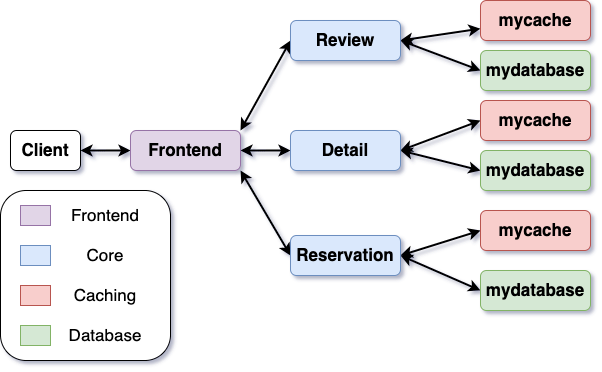

# Lab 3: Caching and Storage

So far, our application is in-memory only and doesn't persist any
data. The goal of this lab is to bring storage into the picture. In
lecture, you have learned that storage is much slower than
memory. Hence, applications using storage usually also involve some
in-memory caching to avoid repeated storage access. This can speed up
storage operations to varying degrees, depending on the caching
policy.

In this lab, we will incorporate separate caching and storage layers
into our application and look at application performance under the lens
of different caching policies and more complex workloads.

## Lab 3 Overview

We will first extend our application by incorporating cache and
storage layers for the core services. Previously, we maintained all of
our application state in memory, which provides no durability to our
application. Adding storage provides durability but at the expense of
larger request latencies and response times.

<div style="text-align: center;">
  
</div>

By incorporating intelligent caching policies within a storage layer,
we can improve overall performance by reducing latencies for some
fraction of the overall workload. In particular, our architecture will
incorporate look-aside caching, where the storage and cache layers
provide service independently of each other. As seen above, the core
application services issue RPC requests to their cache for relevant
data. If the data is unavailable (cache miss), the core services issue
an RPC request to the more durable, but slower, storage
service. Scalability is a critical concern for cloud applications and
this approach allows us to scale caches and storage independently.

In the context of Internet services, request popularities often
follow power laws. A power law refers to a distribution of requests
where a small fraction of values occur at very high frequency and
the rest of the values occur at much lower frequencies. For example,
for an application like Instagram, 20% of all users might generate 80%
of all traffic. In this lab, we will look at how different caching
policies affect the performance of our application under these kinds
of unbalanced workloads.

## Lab 3 Prep Work

We first need to hook in a storage service and a default cache. This
requires us to change a bunch of code.

Make sure to change the tags in your Kubernetes manifests from `lab1` to `lab3`. This way, you can keep your lab1 solution in your Docker Hub repository while also working on your lab3 solution. You can do this by running the following command, replacing `<user>` with your Docker username:
```console
$ sed -i 's/image: .*\/.*/image: <user>\/restaurant_microservice:lab3/g' manifests/*.yaml
```
We will also need to make minor changes to the application. In
particular, we need to modify `cmd/main.go` to intialize the cache and
database services. Copy `cmd/main.go.lab3` to `cmd/main.go` to
make the necessary change.

Furthermore, we need to update our core services to use the cache and
database. We'll simply replace them. You do this by copying the files
in `services_lab3`, overwriting the files in `services`. This replaces
your in-memory implementation with one that uses the cache and
database.

Lastly, you need to implement the manifest files for deploying the
storage and cache layers for detail, review, and reservation (6
manifest files in total). We provide the following sample solution for
the detail storage manifest (`detail-mydatabase.yaml`).

```yaml
##################################################################################################
# detail storage service and deployment
##################################################################################################
apiVersion: v1
kind: Service
metadata:
  name: mydatabase-detail
  labels:
    app: mydatabase-detail
    service: mydatabase-detail
spec:
  ports:
  - port: 27017
    name: grpc
  selector:
    app: mydatabase-detail
---
apiVersion: apps/v1
kind: Deployment
metadata:
  name: mydatabase-detail
  labels:
    app: mydatabase-detail
spec:
  replicas: 1
  selector:
    matchLabels:
      app: mydatabase-detail
  template:
    metadata:
      labels:
        app: mydatabase-detail
    spec:
      imagePullSecrets:
      - name: regcred
      containers:
      - name: mydatabase-detail
        image: <user>/restaurant_microservice:lab3
        command: ["/app/restaurant-microservice"]
        args: ["detail", "database"]
        imagePullPolicy: Always
        ports:
        - containerPort: 27017
        resources:
          limits:
            cpu: 1000m # 1 (virtual if on VM) CPU
          requests:
            cpu: 100m # 100 (virtual) millicpus
```

## Assignment 1: Implement and Test Cache

For this assignment, you will implement the `mycache` service. The
cache and storage APIs will serve as a replacement for your in-memory
data structures from lab 1. Instead, the core services will now issue
RPCs to retrieve desired information.

```protobuf
service CacheService {
  rpc GetItem(GetItemRequest) returns (GetItemResponse) {}
  rpc SetItem(SetItemRequest) returns (SetItemResponse) {}
  rpc DeleteItem(DeleteItemRequest) returns (DeleteItemResponse) {}
}
```
## CacheService

The `CacheService` provides a set of gRPC Remote Procedure Call (RPC) methods for managing an in-memory cache. Clients can interact with the cache by making calls to the RPC methods `GetItem`, `SetItem` and `DeleteItem`. 
1. `GetItem`: issues a get request in a `GetItemRequest` and outputs retrieved data, if it exists, in a `GetItemResponse`.
2. `SetItem`: sets item in the cache as specified in a `SetItemRequest` and returns `SetItemResponse` indicating success of the operation.
3. `DeleteItem`: deletes item from the cache specified in a `DeleteItemRequest` and returns `DeleteItemResponse` indicating success of the operation.

### GetItemRequest

The `GetItemRequest` message is used as the request for the `GetItem` RPC call. It contains the following field:

- `key` (string): The key of the item to retrieve from the cache.

### GetItemResponse

The `GetItemResponse` message is used as the response for the `GetItem` RPC call. It contains a single field:

- `item` (CacheItem): The retrieved cache item.

### SetItemRequest

The `SetItemRequest` message is used as the request for the `SetItem` RPC call. It contains the following field:

- `item` (CacheItem): The cache item to be set in the cache.

### SetItemResponse

The `SetItemResponse` message is used as the response for the `SetItem` RPC call. It contains a single field:

- `success` (bool): A boolean indicating the success of the operation (e.g., whether the item was successfully set in the cache).

### DeleteItemRequest

The `DeleteItemRequest` message is used as the request for the `DeleteItem` RPC call. It contains the following field:

- `key` (string): The key of the item to delete from the cache.

### DeleteItemResponse

The `DeleteItemResponse` message is used as the response for the `DeleteItem` RPC call. It contains a single field:

- `success` (bool): A boolean indicating the success of the operation (e.g., whether the item was successfully deleted from the cache).

### CacheItem

The `CacheItem` message represents an item that can be stored in the cache. It contains the following fields:

- `key` (string): The key associated with the cache item.
- `value` (bytes): The binary data (value) associated with the cache item.

The `CacheService` allows clients to interact with the cache by performing basic operations such as retrieving, setting, and deleting items. The actual implementation of the cache service may vary, but these RPC methods provide a standardized interface for cache management. Your first task in this assignment is to implement the `CacheService` methods in `mycache.go`.

---

We provide a simple implementation for an emulated storage service
under `services/mydatabase.go`. For the sake of clarity and simplicity
in our performance analysis, we will emulate the performance of
a storage device instead of using actual physical
hardware. See the struct `EmulatedStorageApp` under
`applications/storage_apps.go` for more details on each emulated
storage device. We use an emulated cloud storage service instead of
a faster SSD or HDD to make it easier for you to spot when something
was fetched from storage. The emulated
storage devices use very simple models for their behavior. These
models do not reflect real storage device behavior.

Regarding cache policies, we provide a sample implementation of a
[First-in First-out
(FIFO)](https://en.wikipedia.org/wiki/Cache_replacement_policies#First_in_first_out_(FIFO))
cache for reference in `applications/cache_apps.go`. In general, a FIFO cache will perform terribly on
workloads following a pattern (popularity-based, temporal, user, etc.)
since it doesn't incorporate information about how often keys are
accessed, but it is simple to implement and has low overhead. We also
include the Random policy, which simply evicts a key at random.

Your second task in this assignment is to implement two additional caching policies of
your choice.  For instance, you could implement [Least Recently Used
(LRU)](https://en.wikipedia.org/wiki/Cache_replacement_policies#Least_recently_used_(LRU))
and [Least Frequently Used
(LFU)](https://en.wikipedia.org/wiki/Least_frequently_used), which
perform better on certain types of workloads but are more difficult to
implement and more expensive to run. Further examples are [Most
Recently Used
(MRU)](https://en.wikipedia.org/wiki/Cache_replacement_policies#Most_recently_used_(MRU))
and
[Hyperbolic](https://www.usenix.org/system/files/conference/atc17/atc17-blankstein.pdf).
Your cache implementations should go in `applications/cache_apps.go`
and implement the `Cache` interface. You can change which cache policy is
used by replacing `FIFOCacheApp` and `NewFIFOCacheApp` in `mycache.go`.

```go
// Cache is a simple Key-Value cache interface.
type Cache interface {
	// Len returns the number of elements in the cache.
	Len() int

	// Get retrieves the value for the specified key.
	Get(key string) (*mycache.CacheItem, error)

	// Set sets the value for the specified key. If the maximum capacity of the cache is exceeded,
	// an eviction policy is applied.
	Set(item *mycache.CacheItem) error

	// Delete deletes the value for the specified key.
	Delete(key string) error

	// Clear removes all items from the cache.
	Clear()
}
```

**Cache policy testing:** Once you have implemented your cache
policies, you should test them. We have provided a general test
of basic insertion and deletion functionality (`cache_test.go`).
To run this test on your new policies, you will need to add
your policies to `constructCache` in `cache_test.go` and then
run the test as shown below.

You should also test the eviction policies of your caches.
We have provided example tests for LFU and LRU; feel free to
use these if you implement those policies. If you implement
other cache policies, you should write your own tests and
submit your test file along with your code.

Note that these tests create and interact with a cache app
directly rather than via web requests to the frontend, so
your pods do not need to be running during these tests.

```console
# Tests basic insertion and deletion
$ POLICY=<policy_name> go test services_test/lab3/cache_test.go

# Tests the LFU and LRU policies
$ go test services_test/lab3/lfu_cache_test.go
$ go test services_test/lab3/lru_cache_test.go
```

**Application testing:** Once your caches are working, build
and test your complete application by re-running the tests
from lab 1:

```console
# Replace <user> with your docker username

# Build your new application
$ sudo bash scripts/build_image.sh -u <user> -t lab3

# Tests whether your new application has been properly built and uploaded
$ REPO_USER=<user> TAG=lab3 go test services_test/lab1/image_test.go

# Remove all running instances of your application
$ kubectl delete pv,pvc,all --all

# Start your newly built application
$ kubectl apply -f manifests/

# Tests whether your services are live and running without error
$ go test services_test/lab1/kubernetes_test.go

# Tests whether your service retrieves correct HTTP output for review, reservation, and detail 
$ go test services_test/lab1/application_test.go
```

Note that the application is now quite complex, involving many
microservices, and `kubectl apply` may take a while to get it running
again. You can check the status of each pod by running `kubectl get
pods`. Make sure they're all listed as ready before running any
queries to your application.

**Cache behavior testing:** Finally, you'll also
want to test whether the storage layer exhibits the expected
performance behavior. That is, if a requested item hits in the cache,
it should be returned significantly faster than if it is fetched from
the slower database layer.

To do so, you first need to populate the services
with entries that may be requested. We provide the script
`scripts/init-lab3.py` for this purpose. It simply makes a number of
distinct `post-review` and `post-detail` requests to populate the
Detail and Review services. The entries will be about restaurants named
`restaurant[1..]` by users `user[1..]`. You can study the script to
find out the exact entries being created. You can run this script to
populate the Detail and Review services with enough entries, such that
not all of them will fit in the cache.

As the performance of the storage layer depends not just on the cache
design and implementation, but also on the caching policy, a
thorough performance analysis needs to know which requests hit in the
cache and which ones missed. Unfortunately, our application's
interface does not provide a field to indicate cache behavior in
responses - cache behavior is only indicated in service logs. This
makes it hard to match requests to cache behavior.

There are a few workarounds to this problem. For simple tests,
displaying the logs inline with requests and their latency works. For
example:

```console
# Populate Detail and Review services with entries
$ python scripts/init-lab3.py

# Ongoing display of Detail service logs in the background
$ kubectl logs service/detail -f &

# Make a timed get-detail request 
$ time curl 'http://10.96.88.88:8080/get-detail?restaurant_name=restaurant2'
```

This will output the Detail service logs at the same time as the
request is being executed and timed. On a cache hit, you may see
output like this:

```console
$ time curl 'http://10.96.88.88:8080/get-detail?restaurant_name=restaurant1'
{"restaurant_name":"restaurant1","location":"location1","style":"style1","capacity":1}
2024/09/25 22:33:59 grpc;/mycache.CacheService/GetItem;{"key":"restaurant1"};{"item":{"key":"restaurant1","value":"CgtyZXN0YXVyYW50MRIJbG9jYXRpb24xGgZzdHlsZTEgAQ=="}};<nil>;2024-09-25 22:33:59.887252058 +0000 UTC m=+3000.384381459;341

real    0m0.009s
user    0m0.004s
sys     0m0.004s
```

On a cache miss, output may instead look like this:

```console
$ time curl 'http://10.96.88.88:8080/get-detail?restaurant_name=restaurant2'
2024/09/25 22:34:01 grpc;/mycache.CacheService/GetItem;{"key":"restaurant2"};{};rpc error: code = NotFound desc = Item not found in cache!;2024-09-25 22:34:01.184081691 +0000 UTC m=+3001.681211102;283
2024/09/25 22:34:01 grpc;/mydatabase.DatabaseService/GetRecord;{"key":"restaurant2"};{"record":{"key":"restaurant2","value":"CgtyZXN0YXVyYW50MhIJbG9jYXRpb24yGgZzdHlsZTIgAg=="}};<nil>;2024-09-25 22:34:01.184407891 +0000 UTC m=+3001.681537292;100978
{"restaurant_name":"restaurant2","location":"location2","style":"style2","capacity":2}
2024/09/25 22:34:01 grpc;/mycache.CacheService/SetItem;{"item":{"key":"restaurant2","value":"CgtyZXN0YXVyYW50MhIJbG9jYXRpb24yGgZzdHlsZTIgAg=="}};{"success":true};<nil>;2024-09-25 22:34:01.285417642 +0000 UTC m=+3001.782547033;820

real    0m0.067s
user    0m0.008s
sys     0m0.000s
```

Note the significant difference in executed wall-clock time (`real`
line in output) between the two cases. The cloud storage layer is set
to emulate a latency of 50ms, which correlates well with the observed
end-to-end execution latency of a cache miss in this example.

### **Deliverables**

In your writeup for Assignment 1, discuss the following:

-How did you design your cache? Which policies did you choose to
implement, how do they work, and why did you choose these policies?

-Include performance numbers that show the service latency
(e.g., for the Detail service), for items that hit in the cache as
well as for items that miss the cache.

-Discuss how the observed end-to-end latencies correlate with the
performance of your caching and storage layers.

## Assignment 2: Read Latency Analysis: Caching Policies

Next, we will look at the performance of our application under a more
complex workload. Our sample workload in lab 2 accessed a small number
of elements from the detail service. In this
assignment, our workload instead reads many different elements, and
over both the detail and review services. While caches can benefit
writes, too, we are primarily interested in their ability to improve
read access latencies in this assignment. Since the workload sends
read requests to two services, it also means that two caches are
involved (each service has its own storage and caching layer). This
shouldn't really change the outcome of the experiment - the workload
generates even load among the two services - but it exercises more
parts of your application during benchmarking.

**Zipfian access pattern:** As mentioned in the overview, real-world
workloads often follow power laws where a minority of the requests
tend to dominate the overall workload. Our workload for lab 3,
specified in `workloads/lab3/zipf-mixed.lua`, follows a [Zipf
distribution](https://en.wikipedia.org/wiki/Zipf%27s_law#:~:text=Zipf),
a discrete probability distribution that captures the power law
behavior. In particular, given a dataset size $N$ and scaling exponent
$`\alpha \geq 0`$, the probability of the $`i^{th}`$ (such that $`1
\leq i \leq N`$) entry occurring is $`P(X=i | \alpha, N) = \frac{1}{i
^ \alpha} \cdot \frac{1}{\sum_{j =1}^N{1/j^\alpha}}`$.

**Notes on CacheSize and DatasetSize**: the cache size for each
service is set to 10 (in `main.go`) but the dataset size for each
service is 100 entries. For each request, `wrk2` will randomly
sample from a Zipfian distribution with $\alpha = 1.5$ and $N =
100$. Our per-service "storage" layer does not limit the number of
entries but the cache holds at most 10% of the overall dataset in this
configuration. Hence, there will be cache misses and each cache miss
will force the application to issue a request to storage, thereby
incurring additional latency.

**Latency CDFs**: Averages may be deceiving when evaluating the
latency performance of certain workloads. For example, in our case,
request latency is primarily affected by whether a requested item hits
in the cache and is served from there or whether it misses and needs
to be fetched from slower storage. Averaging over these two cases will
produce a latency figure that doesn't truly represent either case.

For workloads such as ours, it is better to characterize latency in
more detail. There are a variety of ways to do this, but a common way
is to use **cumulative distribution functions (CDFs)**. A CDF is a
cumulative summary of the measured performance data that helps you
understand it across the entire range of values, rather than just
looking at an average or median. Essentially, a CDF tells you the
probability that a measured variable will take a value less than or
equal to a specific value.

**Step-by-step explanation of a CDF:**

1. **Gather some measurement data:** Let's say you record the latency
   (in ms) of 10 different requests to your application:
   
   - 100 ms, 150 ms, 120 ms, 130 ms, 140 ms, 110 ms, 160 ms, 135 ms, 125 ms, 145 ms

2. **Sort the data in ascending order:** 
   To create the CDF, first sort the latencies:
   
   - 100 ms, 110 ms, 120 ms, 125 ms, 130 ms, 135 ms, 140 ms, 145 ms, 150 ms, 160 ms

3. **Calculate the Cumulative Probability:**
The cumulative distribution is the fraction of data points that are less than or equal to a given value. For each point in your sorted data, compute the CDF as follows:

| Latency (ms) | Cumulative Count | Cumulative Probability |
|--------------|------------------|------------------------|
| 100          | 1                | 1/10 = 0.1             |
| 110          | 2                | 2/10 = 0.2             |
| 120          | 3                | 3/10 = 0.3             |
| 125          | 4                | 4/10 = 0.4             |
| 130          | 5                | 5/10 = 0.5             |
| 135          | 6                | 6/10 = 0.6             |
| 140          | 7                | 7/10 = 0.7             |
| 145          | 8                | 8/10 = 0.8             |
| 150          | 9                | 9/10 = 0.9             |
| 160          | 10               | 10/10 = 1.0            |

4. **Plot the data:**
You will plot the latency values on the x-axis and the cumulative probability (CDF) on the y-axis.

Once you have plotted the points, connect them with a line to form a
**step function**. The CDF is typically plotted as a step function
because it shows the cumulative proportion of values that are less
than or equal to a certain threshold. At each latency value, the CDF
jumps to the next cumulative probability.

For example, the graph will:
- Start at 0 when latency is below the minimum (100 ms in this case).
- Jump to 0.1 at 100 ms (10% of the values are less than or equal to 100 ms).
- Continue to jump at each latency value until it reaches 1 at 160 ms (all values are less than or equal to 160 ms).

5. **Interpret the CDF:**
   The CDF graph will be a line that starts at 0 and approaches 1 (or 100%) as you move right along the x-axis (latency values).
   
   - If you want to know the probability that the latency is **less than or equal to 135 ms**, look up 135 ms in the CDF, and you’ll see that the CDF at 135 ms is 6/10 or 0.6 (60%). This means 60% of the responses have a latency of 135 ms or less.
   - If you look at 160 ms, you see that 100% of the responses have a latency of 160 ms or less (CDF at 160 ms = 1).

**Why are CDFs useful?**
A CDF provides a clear picture of the distribution of response latencies. For example:
- If you want to understand **how often** your application responds in under 150 ms, the CDF can tell you exactly what percentage of requests are faster than 150 ms.
- You can also find **percentile values** easily. If you're interested in the **95th percentile latency** (the latency value below which 95% of the responses lie), you can use the CDF to estimate that. For example, if the 95th percentile latency is 155 ms, then 95% of the requests will take 155 ms or less to complete.

### **Tasks**

You are tasked with characterizing latency by
generating cumulative distribution functions (CDFs) thereof for the
following four scenarios:

1. Application with no cache (just emulated storage). A fair way to
   disable the cache is to set the cache capacity to 0
   (cf. `detailCacheCapacity`, `reviewCacheCapacity`, and
   `reservationCacheCapacity` in `cmd/main.go`).

2. Application with your first caching policy.

3. Application with your second caching policy.

4. Application with your choice of one of the provided caching
policies.

Make sure to specify emulated cloud storage for all of the above
scenarios. To do this, check that `storageDeviceType` is set to `cloud` in
`cmd/main.go`. You can also display the logs of the mydatabase
services at startup - they should output `cloud` as the emulated
device.

**Running the workload**: Our workload (in
`workloads/lab3/zipf-mixed.lua`) will read entries via `get-detail` and
`get-review` requests, according to a Zipfian distribution. You can
use the same `scripts/init-lab3.py` script from assignment 1 to
populate your application with appropriate entries that the workload
will attempt to request.

We will run `wrk2` in a similar way to lab2. However, our emulated
storage layer will vastly slow down the application. If all requests
come from storage, with a 50ms access latency, the application will not
be able to handle more than a few requests per second. Consequently,
we need to reduce our request rate drastically, so as to not overload
the application. Otherwise, measured latencies would be dominated by
the queueing latency of waiting requests.

To record the individual latencies for requests sent from `wrk2` to the
application, you can run `wrk2` with the `-P` option, which prints all
request latencies to stdout. Since that is a lot of output, you want
to redirect it to a file. Here is a good way to run
`wrk2` for this assignment:

```console
$ taskset -c 0-2 wrk2/wrk -D exp -t 1 -c 1 -d2m -s workloads/lab3/zipf-mixed.lua http://10.96.88.88:8080 -R 10 -P > wrk.txt
```

Even with this low rate, check that reported request latencies are not
continually increasing, indicating overload. If they are, reduce your request rate further.

The behavior of a cache depends on what data is in the cache. When
you first initialize your application, the most popular data might
not be in the cache, whereas it will be later after your application
has run for a while. To make sure your measurements capture this
steady-state behavior, it is best to ``warm up'' your cache first. Thus
when collecting data for each of the four scenarios above, we recommend
doing the following:

1. Restart your entire microservice application.

2. Run the `scripts/init-lab3.py` script to populate your application
with data.

3. Run `wrk` once and discard the measurement results. This will warm
up the caches.

4. Run `wrk` again and use those results for your graphs and anaylsis.

You can plot your data using `plot_cdf.py`.
```console
$ python scripts/plot_cdf.py wrk.txt
```

### **Deliverables**

In your writeup for Assignment 2, include the four latency CDFs and discuss the following.

**Writeup:** Before running the experiments, predict the ranking of
the four caching scenarios above from best to worst:

1. In terms of cache hit rate.

2. In terms of 99th percentile request latency.

Once you have latency CDFs for each scenario, answer the following
discussion questions in your writeup:

- Can you deduce the cache hit rate from the latency CDF? What is it
  for each of the caching policies?

- What else does each latency CDF tell you? For example, is there a
  fraction of requests that still experience queueing? If so, what
  fraction is it and how did you determine it?

- How does the request latency distribution change for each of the
  policies? Formulate a hypothesis describing why each policy achieves
  a certain distribution.

- Do the latency CDFs confirm or refute your ranking of the caching
  scenarios? Discuss your hypothesis in light of your results.

## Submission
Create a single PDF that includes your graphs and write-ups for both assignments above. Submit this PDF to Gradescope.

In addition, submit a tar file of your final lab 3 image. You can generate the tar file using the following commands. Make sure to rebuild your image using the `lab3` tag.
```console
$ sudo bash scripts/build_image.sh -u <user> -t lab3
$ sudo docker save -o <groupno>-lab3.tar <user>/restaurant_microservice:lab3
$ sudo chmod +r <groupno>-lab3.tar
```
Submit your image tarball to Gradescope.
<!-- for staff: docker load -i image.tar -->

Finally, commit your code to your team git repo.
```console
$ git commit -m "lab 3 submission"
$ git push
```